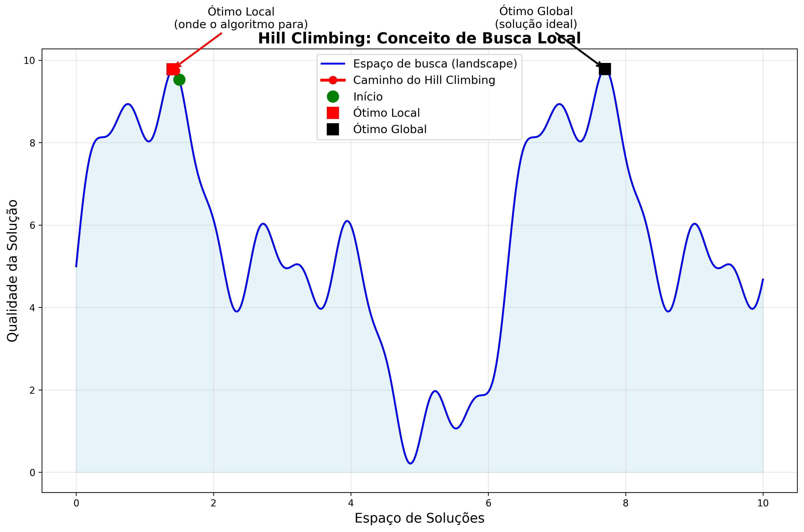

# Hill Climbing: Uma Abordagem Heurística para Otimização

Hill Climbing é um algoritmo heurístico usado em problemas de otimização, onde o objetivo é encontrar a solução ideal (ou quase ideal) em um espaço de busca grande. Ele é amplamente aplicado em problemas como a otimização de funções, o problema do caixeiro viajante (TSP), agendamento e muitos outros. Apesar de sua simplicidade, Hill Climbing é um conceito poderoso e um ponto de partida para entender técnicas mais avançadas de otimização.



---

## **1. O Conceito de Hill Climbing**

O nome "Hill Climbing" (escalada de colinas) reflete a ideia central do algoritmo: dado um ponto inicial em um espaço de busca, o algoritmo tenta se mover para um ponto adjacente que ofereça uma melhoria, como subir uma colina. O processo continua até que nenhuma melhoria seja possível, indicando que o algoritmo alcançou um **pico local** ou global.

### **1.1 Analogia com Escalada Real**

Imagine que você está em uma montanha coberta de névoa e quer chegar ao pico mais alto. Como você não consegue ver o terreno ao redor, sua estratégia é:

1. **Sentir o terreno**: Verificar se o terreno ao seu redor está subindo ou descendo
2. **Dar um passo**: Mover-se na direção que sobe mais
3. **Repetir**: Continuar até não conseguir subir mais

Esta é exatamente a lógica do algoritmo Hill Climbing!

### **1.2 Objetivos do Algoritmo**

O objetivo pode variar conforme o problema:
- **Maximização:** Encontrar o pico mais alto (maior valor da função)
- **Minimização:** Encontrar o vale mais profundo (menor valor da função)

Em ambos os casos, o princípio é o mesmo: realizar passos incrementais em direção a uma solução melhor.

---

## **2. Como Funciona o Algoritmo Hill Climbing**


### **2.1 Passos Básicos**

O algoritmo Hill Climbing segue uma sequência lógica e simples:

1. **🚀 Ponto de partida:** Escolha uma solução inicial (geralmente de forma aleatória)
2. **🔍 Exploração da vizinhança:** Encontre soluções vizinhas que estão "próximas" da solução atual
3. **📊 Avaliação:** Calcule a qualidade (ou "fitness") de cada solução vizinha
4. **⬆️ Movimento:** Mova-se para a melhor solução vizinha, se ela for melhor do que a solução atual
5. **🎯 Convergência:** Pare quando nenhuma melhoria for possível (um ótimo local foi alcançado)

### **2.2 Representação Visual do Processo**

A imagem abaixo ilustra a diferença fundamental entre Hill Climbing e algoritmos mais avançados como Simulated Annealing:


**Observações importantes:**
- **Hill Climbing (vermelho):** Fica preso no primeiro ótimo local encontrado
- **Simulated Annealing (magenta):** Pode escapar de ótimos locais e encontrar soluções melhores

### **2.3 Definição de "Vizinhança"**

A definição de vizinhança é crucial e varia conforme o problema:

| **Problema** | **Solução** | **Vizinho** | **Exemplo** |
|--------------|-------------|-------------|-------------|
| Problema do Caixeiro Viajante | Sequência de cidades | Trocar duas cidades de posição | [A,B,C,D] → [A,C,B,D] |
| Otimização de função | Ponto (x,y) | Pequeno deslocamento | (2.1, 3.5) → (2.2, 3.4) |
| Agendamento | Atribuição de tarefas | Trocar horário de duas tarefas | Tarefa1(9h) ↔ Tarefa2(10h) |

---

## **3. Tipos de Hill Climbing**

Existem várias variações do algoritmo básico, cada uma com suas características específicas:

### **3.1 🔢 Simple Hill Climbing (Simples)**
```
PARA cada vizinho V da solução atual S:
    SE qualidade(V) > qualidade(S):
        S ← V
        PARAR (aceita o primeiro vizinho melhor)
```
**Características:**
- ✅ **Vantagem:** Muito rápido
- ❌ **Desvantagem:** Pode escolher vizinhos subótimos

### **3.2 ⛰️ Steepest-Ascent Hill Climbing (Subida Mais Íngreme)**
```
melhor_vizinho ← NULL
PARA cada vizinho V da solução atual S:
    SE qualidade(V) > qualidade(melhor_vizinho):
        melhor_vizinho ← V

SE qualidade(melhor_vizinho) > qualidade(S):
    S ← melhor_vizinho
```
**Características:**
- ✅ **Vantagem:** Sempre escolhe a melhor melhoria disponível
- ❌ **Desvantagem:** Mais lento (avalia todos os vizinhos)

### **3.3 🎲 Stochastic Hill Climbing (Estocástico)**
```
vizinhos_melhores ← LISTA de vizinhos melhores que S
SE vizinhos_melhores NÃO está vazia:
    S ← ESCOLHER_ALEATORIAMENTE(vizinhos_melhores)
```
**Características:**
- ✅ **Vantagem:** Adiciona aleatoriedade, pode encontrar caminhos diferentes
- ⚖️ **Balanceamento:** Entre velocidade e qualidade

### **3.4 🎯 First-Choice Hill Climbing (Primeira Escolha)**
```
ENQUANTO verdadeiro:
    vizinho ← GERAR_VIZINHO_ALEATÓRIO(S)
    SE qualidade(vizinho) > qualidade(S):
        S ← vizinho
        PARAR
```
**Características:**
- ✅ **Vantagem:** Útil quando há muitos vizinhos
- 🚀 **Uso:** Ideal para espaços de busca muito grandes

---

## **4. Vantagens e Desvantagens**

### **4.1 ✅ Vantagens**

| **Vantagem** | **Descrição** | **Benefício Prático** |
|--------------|---------------|----------------------|
| **Simplicidade** | Fácil de implementar e compreender | Ideal para prototipagem rápida |
| **Eficiência** | Pode ser rápido para encontrar uma solução aceitável | Bom para problemas com restrições de tempo |
| **Memória Mínima** | Requer pouca ou nenhuma memória adicional | Funciona em sistemas com recursos limitados |
| **Convergência Rápida** | Converge rapidamente para um ótimo local | Útil quando "bom o suficiente" é aceitável |

### **4.2 ❌ Desvantagens**

| **Desvantagem** | **Descrição** | **Impacto** |
|-----------------|---------------|-------------|
| **Ótimos Locais** | Pode ficar preso em ótimos locais | ⚠️ **CRÍTICO:** Pode perder a solução ótima global |
| **Falta de Visão Global** | Não considera o espaço de busca como um todo | Decisões míopes podem ser subótimas |
| **Dependência da Solução Inicial** | O resultado varia com o ponto de partida | Resultados inconsistentes |
| **Problemas com Platôs** | Pode parar em regiões planas | Não explora adequadamente espaços uniformes |

### **4.3 🎯 Quando Usar Hill Climbing**

**✅ Cenários Ideais:**
- Problemas com poucos ótimos locais
- Quando uma solução "boa o suficiente" é aceitável
- Recursos computacionais limitados
- Prototipagem rápida de soluções

**❌ Cenários Problemáticos:**
- Problemas com muitos ótimos locais
- Quando o ótimo global é crucial
- Espaços de busca com muitos platôs
- Funções objetivos muito rugosas

---

## **5. Estratégias para Superar Ótimos Locais**

O principal problema do Hill Climbing é ficar preso em ótimos locais. Várias estratégias podem mitigar este problema:

### **5.1 🔄 Random Restarts (Reinicializações Aleatórias)**
```python
def hill_climbing_com_restarts(problema, num_tentativas):
    melhor_solucao = None
    melhor_custo = infinito
    
    for tentativa in range(num_tentativas):
        solucao = hill_climbing(problema, solucao_inicial_aleatoria())
        if custo(solucao) < melhor_custo:
            melhor_solucao = solucao
            melhor_custo = custo(solucao)
    
    return melhor_solucao
```

**Como funciona:**
- Executa o Hill Climbing várias vezes com pontos de partida diferentes
- Mantém a melhor solução encontrada em todas as execuções
- ⚡ **Eficácia:** Aumenta significativamente a chance de encontrar o ótimo global

### **5.2 🌡️ Simulated Annealing**
- Adiciona uma probabilidade de aceitar soluções piores
- A probabilidade diminui com o tempo (como o resfriamento de metais)
- 🎯 **Objetivo:** Escapar de ótimos locais explorando temporariamente soluções piores

### **5.3 🧬 Algoritmos Genéticos**
- Combina Hill Climbing com técnicas evolutivas
- Mantém uma população de soluções
- 🔄 **Processo:** Crossover e mutação geram novas soluções

### **5.4 🚫 Tabu Search**
- Registra soluções visitadas recentemente em uma "lista tabu"
- Evita revisitar soluções recentes
- 🛡️ **Benefício:** Previne ciclos e força exploração de novas regiões

### **5.5 📊 Comparação das Estratégias**

| **Estratégia** | **Complexidade** | **Eficácia** | **Custo Computacional** | **Melhor Para** |
|----------------|------------------|--------------|-------------------------|-----------------|
| Random Restarts | Baixa | Alta | Médio | Problemas gerais |
| Simulated Annealing | Média | Muito Alta | Alto | Problemas complexos |
| Algoritmos Genéticos | Alta | Muito Alta | Muito Alto | Problemas multimodais |
| Tabu Search | Média | Alta | Alto | Problemas com ciclos |

---

## **6. Aplicações Práticas do Hill Climbing**

O Hill Climbing tem aplicações em diversos domínios. Vamos explorar alguns casos práticos:

### **6.1 🗺️ Problema do Caixeiro Viajante (TSP)**

**Contexto:** Dado um conjunto de cidades e suas distâncias, encontrar o menor percurso que visite todas as cidades uma vez e retorne ao ponto inicial.

**Implementação com Hill Climbing:**
```python
def tsp_hill_climbing(cidades):
    # Solução inicial: tour aleatório
    tour_atual = list(range(len(cidades)))
    random.shuffle(tour_atual)
    
    melhorado = True
    while melhorado:
        melhorado = False
        
        # Tenta trocar cada par de cidades
        for i in range(len(tour_atual)):
            for j in range(i + 1, len(tour_atual)):
                # Cria novo tour trocando cidades i e j
                novo_tour = tour_atual.copy()
                novo_tour[i], novo_tour[j] = novo_tour[j], novo_tour[i]
                
                # Se o novo tour é melhor, aceita
                if distancia_total(novo_tour) < distancia_total(tour_atual):
                    tour_atual = novo_tour
                    melhorado = True
                    break
            if melhorado:
                break
    
    return tour_atual
```

**Vizinhança no TSP:**
- **2-opt:** Trocar duas arestas do tour
- **Swap:** Trocar posições de duas cidades
- **Insert:** Mover uma cidade para outra posição

### **6.2 ⚙️ Ajuste de Hiperparâmetros**

**Aplicação:** Otimizar parâmetros de modelos de machine learning.

**Exemplo prático:**
```python
def otimizar_hiperparametros(modelo, dados_treino, dados_validacao):
    # Parâmetros iniciais
    params = {
        'learning_rate': 0.01,
        'batch_size': 32,
        'hidden_layers': 2
    }
    
    melhor_acuracia = avaliar_modelo(modelo, params, dados_treino, dados_validacao)
    
    melhorado = True
    while melhorado:
        melhorado = False
        
        # Tenta ajustar cada parâmetro
        for param_name in params:
            # Gera vizinhos alterando o parâmetro
            for variacao in gerar_variacoes(param_name, params[param_name]):
                novos_params = params.copy()
                novos_params[param_name] = variacao
                
                acuracia = avaliar_modelo(modelo, novos_params, dados_treino, dados_validacao)
                
                if acuracia > melhor_acuracia:
                    params = novos_params
                    melhor_acuracia = acuracia
                    melhorado = True
                    break
        
    return params, melhor_acuracia
```

### **6.3 📅 Planejamento e Agendamento**

**Cenário:** Alocação de salas de aula em uma universidade.

**Elementos do problema:**
- **Variáveis:** Disciplinas, professores, salas, horários
- **Restrições:** Professor não pode estar em dois lugares, capacidade das salas
- **Objetivo:** Minimizar conflitos e maximizar utilização

**Estratégia de vizinhança:**
```python
def gerar_vizinhos_agendamento(agendamento_atual):
    vizinhos = []
    
    # Tipo 1: Trocar horários de duas disciplinas
    for i in range(len(agendamento_atual)):
        for j in range(i + 1, len(agendamento_atual)):
            novo_agendamento = agendamento_atual.copy()
            novo_agendamento[i], novo_agendamento[j] = novo_agendamento[j], novo_agendamento[i]
            vizinhos.append(novo_agendamento)
    
    # Tipo 2: Mover disciplina para horário vazio
    for disciplina in agendamento_atual:
        for horario_vazio in encontrar_horarios_vazios():
            novo_agendamento = mover_disciplina(agendamento_atual, disciplina, horario_vazio)
            vizinhos.append(novo_agendamento)
    
    return vizinhos
```

### **6.4 🧠 Redes Neurais - Otimização de Pesos**

**Aplicação:** Ajustar pesos de uma rede neural simples.

```python
def hill_climbing_rede_neural(rede, dados_treino):
    pesos_atuais = rede.get_pesos()
    erro_atual = calcular_erro(rede, dados_treino)
    
    melhorado = True
    step_size = 0.01
    
    while melhorado:
        melhorado = False
        
        # Para cada peso, tenta pequenos ajustes
        for i in range(len(pesos_atuais)):
            # Tenta aumentar o peso
            pesos_atuais[i] += step_size
            rede.set_pesos(pesos_atuais)
            novo_erro = calcular_erro(rede, dados_treino)
            
            if novo_erro < erro_atual:
                erro_atual = novo_erro
                melhorado = True
                continue
            
            # Se não melhorou, tenta diminuir
            pesos_atuais[i] -= 2 * step_size
            rede.set_pesos(pesos_atuais)
            novo_erro = calcular_erro(rede, dados_treino)
            
            if novo_erro < erro_atual:
                erro_atual = novo_erro
                melhorado = True
            else:
                # Volta ao valor original
                pesos_atuais[i] += step_size
    
    return rede, erro_atual
```

### **6.5 🎯 Resumo das Aplicações**

| **Domínio** | **Problema** | **Solução** | **Vizinhança** | **Função Objetivo** |
|-------------|--------------|-------------|----------------|-------------------|
| **Logística** | TSP | Sequência de cidades | Swap, 2-opt | Minimizar distância |
| **ML** | Hiperparâmetros | Conjunto de parâmetros | Ajustes incrementais | Maximizar acurácia |
| **Educação** | Agendamento | Atribuição tempo/espaço | Troca de horários | Minimizar conflitos |
| **IA** | Redes Neurais | Vetor de pesos | Perturbações pequenas | Minimizar erro |

---

## **7. Pseudocódigo Detalhado do Hill Climbing**

### **7.1 📝 Algoritmo Principal**

```plaintext
FUNÇÃO HillClimbing(Problema):
    // 1. Inicialização
    S ← GerarSolucaoInicial(Problema)
    CustoAtual ← CalcularCusto(S)
    
    // 2. Variáveis de controle
    iteracao ← 0
    max_iteracoes ← 1000
    
    // 3. Loop principal
    ENQUANTO iteracao < max_iteracoes:
        // 3a. Gerar vizinhança
        Vizinhos ← GerarVizinhos(S)
        
        // 3b. Encontrar melhor vizinho
        MelhorVizinho ← NULL
        MelhorCusto ← infinito
        
        PARA CADA vizinho V EM Vizinhos:
            CustoV ← CalcularCusto(V)
            SE CustoV < MelhorCusto:
                MelhorVizinho ← V
                MelhorCusto ← CustoV
        
        // 3c. Verificar se houve melhoria
        SE MelhorCusto < CustoAtual:
            S ← MelhorVizinho
            CustoAtual ← MelhorCusto
            iteracao ← iteracao + 1
        SENÃO:
            // Ótimo local encontrado
            PARAR
    
    // 4. Retornar resultado
    RETORNAR S, CustoAtual
```

### **7.2 🔄 Variação com Random Restarts**

```plaintext
FUNÇÃO HillClimbingComRestarts(Problema, NumTentativas):
    MelhorSolucao ← NULL
    MelhorCusto ← infinito
    
    PARA tentativa ← 1 ATÉ NumTentativas:
        // Executa Hill Climbing com solução inicial aleatória
        Solucao, Custo ← HillClimbing(Problema)
        
        SE Custo < MelhorCusto:
            MelhorSolucao ← Solucao
            MelhorCusto ← Custo
        
        // Log do progresso
        IMPRIMIR("Tentativa", tentativa, "- Custo:", Custo)
    
    RETORNAR MelhorSolucao, MelhorCusto
```

### **7.3 ⚡ Variação First-Choice**

```plaintext
FUNÇÃO FirstChoiceHillClimbing(Problema):
    S ← GerarSolucaoInicial(Problema)
    CustoAtual ← CalcularCusto(S)
    
    ENQUANTO verdadeiro:
        // Gera vizinhos aleatórios até encontrar uma melhoria
        tentativas ← 0
        max_tentativas ← 100
        
        ENQUANTO tentativas < max_tentativas:
            VizinhoAleatorio ← GerarVizinhoAleatorio(S)
            CustoVizinho ← CalcularCusto(VizinhoAleatorio)
            
            SE CustoVizinho < CustoAtual:
                S ← VizinhoAleatorio
                CustoAtual ← CustoVizinho
                PARAR  // Sai do loop interno
            
            tentativas ← tentativas + 1
        
        // Se não encontrou melhoria após max_tentativas
        SE tentativas >= max_tentativas:
            PARAR  // Ótimo local
    
    RETORNAR S, CustoAtual
```

### **7.4 📊 Explicação dos Componentes**

#### **Inicialização**
- A solução inicial pode ser gerada aleatoriamente ou usar conhecimento do domínio
- **Dica:** Uma boa solução inicial pode reduzir significativamente o tempo de convergência

#### **Geração de Vizinhos**
A função `GerarVizinhos(S)` varia conforme o problema:

**Para TSP:**
```python
def gerar_vizinhos_tsp(tour):
    vizinhos = []
    for i in range(len(tour)):
        for j in range(i + 1, len(tour)):
            novo_tour = tour.copy()
            novo_tour[i], novo_tour[j] = novo_tour[j], novo_tour[i]  # Swap
            vizinhos.append(novo_tour)
    return vizinhos
```

**Para otimização contínua:**
```python
def gerar_vizinhos_continuo(ponto, step_size=0.1):
    vizinhos = []
    for i in range(len(ponto)):
        # Vizinho à direita
        vizinho_dir = ponto.copy()
        vizinho_dir[i] += step_size
        vizinhos.append(vizinho_dir)
        
        # Vizinho à esquerda
        vizinho_esq = ponto.copy()
        vizinho_esq[i] -= step_size
        vizinhos.append(vizinho_esq)
    return vizinhos
```

#### **Critério de Parada**
O algoritmo pode parar quando:
- 🎯 Nenhuma melhoria é encontrada (ótimo local)
- ⏰ Número máximo de iterações é atingido
- 🎯 Qualidade da solução atinge um limiar aceitável
- ⏱️ Tempo limite é excedido

### **8.3 ⚡ Implementação com Random Restarts**

```python
def hill_climbing_com_restarts(problema, num_tentativas=10, verbose=True):
    """
    Executa Hill Climbing múltiplas vezes com diferentes pontos iniciais
    
    Args:
        problema: Instância do problema (TSP, otimização, etc.)
        num_tentativas: Número de execuções independentes
        verbose: Se True, mostra progresso
    
    Returns:
        Melhor solução encontrada em todas as tentativas
    """
    melhor_solucao_global = None
    melhor_valor_global = float('inf')
    historico_tentativas = []
    
    if verbose:
        print(f"🔄 Executando Hill Climbing com {num_tentativas} tentativas")
        print("=" * 60)
    
    for tentativa in range(num_tentativas):
        if verbose:
            print(f"\n🎯 Tentativa {tentativa + 1}/{num_tentativas}")
        
        # Executa Hill Climbing
        if hasattr(problema, 'resolver'):  # Para TSP
            solucao, valor = problema.resolver(verbose=False)
        else:  # Para otimização de funções
            solucao, valor = problema.otimizar(verbose=False)
        
        historico_tentativas.append((solucao, valor))
        
        if valor < melhor_valor_global:
            melhor_solucao_global = solucao
            melhor_valor_global = valor
            if verbose:
                print(f"   ✅ Nova melhor solução! Valor: {valor:.4f}")
        else:
            if verbose:
                print(f"   ⚪ Valor: {valor:.4f}")
    
    if verbose:
        print(f"\n🏆 MELHOR RESULTADO:")
        print(f"   Solução: {melhor_solucao_global}")
        print(f"   Valor: {melhor_valor_global:.4f}")
        
        # Estatísticas
        valores = [entrada[1] for entrada in historico_tentativas]
        print(f"\n📊 ESTATÍSTICAS:")
        print(f"   Melhor: {min(valores):.4f}")
        print(f"   Pior: {max(valores):.4f}")
        print(f"   Média: {sum(valores)/len(valores):.4f}")
        print(f"   Desvio: {(max(valores) - min(valores)):.4f}")
    
    return melhor_solucao_global, melhor_valor_global, historico_tentativas

# Exemplo de uso com Random Restarts
if __name__ == "__main__":
    # Para otimização de funções
    otimizador = HillClimbingOtimizador(
        funcao_objetivo=lambda x: (x[0]-2)**2 + (x[1]-3)**2,  # Mínimo em (2,3)
        limites=[(-10, 10), (-10, 10)],
        step_size=0.1
    )
    
    melhor_sol, melhor_val, historico = hill_climbing_com_restarts(
        otimizador, 
        num_tentativas=5
    )
```

### **8.4 📈 Análise de Performance**

```python
import time
import numpy as np

def analisar_performance_hill_climbing():
    """Analisa performance do Hill Climbing em diferentes cenários"""
    
    print("🔬 ANÁLISE DE PERFORMANCE DO HILL CLIMBING")
    print("=" * 60)
    
    # Teste 1: Função com múltiplos ótimos locais
    def funcao_multimodal(x):
        return np.sin(x[0]) * np.cos(x[1]) + 0.1*(x[0]**2 + x[1]**2)
    
    otimizador1 = HillClimbingOtimizador(
        funcao_objetivo=funcao_multimodal,
        limites=[(-10, 10), (-10, 10)],
        step_size=0.1
    )
    
    print("\n🎯 Teste 1: Função Multimodal")
    inicio = time.time()
    sol1, val1, hist1 = hill_climbing_com_restarts(otimizador1, 10, verbose=False)
    tempo1 = time.time() - inicio
    print(f"   Tempo: {tempo1:.3f}s | Melhor valor: {val1:.6f} | Tentativas: 10")
    
    # Teste 2: Função unimodal (um só ótimo)
    def funcao_unimodal(x):
        return (x[0]-3)**2 + (x[1]+2)**2
    
    otimizador2 = HillClimbingOtimizador(
        funcao_objetivo=funcao_unimodal,
        limites=[(-10, 10), (-10, 10)],
        step_size=0.1
    )
    
    print("\n🎯 Teste 2: Função Unimodal")
    inicio = time.time()
    sol2, val2 = otimizador2.otimizar(verbose=False)
    tempo2 = time.time() - inicio
    print(f"   Tempo: {tempo2:.3f}s | Valor: {val2:.6f} | Uma tentativa")
    
    # Teste 3: TSP com diferentes tamanhos
    tamanhos_tsp = [5, 10, 15, 20]
    print(f"\n🎯 Teste 3: TSP com diferentes tamanhos")
    
    for tamanho in tamanhos_tsp:
        # Gerar cidades aleatórias
        cidades = [(random.uniform(0, 100), random.uniform(0, 100)) 
                  for _ in range(tamanho)]
        
        tsp = TSPHillClimbing(cidades)
        
        inicio = time.time()
        tour, distancia = tsp.resolver(verbose=False)
        tempo = time.time() - inicio
        
        print(f"   {tamanho} cidades: {tempo:.3f}s | Distância: {distancia:.2f}")

# Executar análise
if __name__ == "__main__":
    analisar_performance_hill_climbing()
```

---

## **8. 💻 Implementação Completa em Python**

### **8.1 🎯 Implementação para Otimização de Funções**

```python
import random
import math
import matplotlib.pyplot as plt

class HillClimbingOtimizador:
    def __init__(self, funcao_objetivo, limites, step_size=0.1):
        """
        Inicializa o otimizador Hill Climbing
        
        Args:
            funcao_objetivo: Função a ser otimizada (retorna valor a ser minimizado)
            limites: Lista de tuplas [(min_x, max_x), (min_y, max_y), ...]
            step_size: Tamanho do passo para gerar vizinhos
        """
        self.funcao_objetivo = funcao_objetivo
        self.limites = limites
        self.step_size = step_size
        self.historico = []
    
    def gerar_solucao_inicial(self):
        """Gera uma solução inicial aleatória dentro dos limites"""
        return [random.uniform(limite[0], limite[1]) for limite in self.limites]
    
    def gerar_vizinhos(self, solucao):
        """Gera vizinhos alterando cada dimensão"""
        vizinhos = []
        
        for i in range(len(solucao)):
            # Vizinho com incremento
            vizinho_inc = solucao.copy()
            vizinho_inc[i] += self.step_size
            
            # Verifica se está dentro dos limites
            if self.limites[i][0] <= vizinho_inc[i] <= self.limites[i][1]:
                vizinhos.append(vizinho_inc)
            
            # Vizinho com decremento
            vizinho_dec = solucao.copy()
            vizinho_dec[i] -= self.step_size
            
            # Verifica se está dentro dos limites
            if self.limites[i][0] <= vizinho_dec[i] <= self.limites[i][1]:
                vizinhos.append(vizinho_dec)
        
        return vizinhos
    
    def otimizar(self, max_iteracoes=1000, verbose=True):
        """
        Executa o algoritmo Hill Climbing
        
        Args:
            max_iteracoes: Número máximo de iterações
            verbose: Se True, imprime progresso
            
        Returns:
            Tupla (melhor_solucao, melhor_valor)
        """
        # Inicialização
        solucao_atual = self.gerar_solucao_inicial()
        valor_atual = self.funcao_objetivo(solucao_atual)
        
        self.historico = [(solucao_atual.copy(), valor_atual)]
        
        if verbose:
            print(f"Solução inicial: {solucao_atual}")
            print(f"Valor inicial: {valor_atual:.6f}")
            print("-" * 50)
        
        # Loop principal
        for iteracao in range(max_iteracoes):
            # Gerar vizinhos
            vizinhos = self.gerar_vizinhos(solucao_atual)
            
            if not vizinhos:
                if verbose:
                    print("Nenhum vizinho válido encontrado!")
                break
            
            # Encontrar melhor vizinho
            melhor_vizinho = None
            melhor_valor_vizinho = float('inf')
            
            for vizinho in vizinhos:
                valor_vizinho = self.funcao_objetivo(vizinho)
                if valor_vizinho < melhor_valor_vizinho:
                    melhor_vizinho = vizinho
                    melhor_valor_vizinho = valor_vizinho
            
            # Verificar se houve melhoria
            if melhor_valor_vizinho < valor_atual:
                solucao_atual = melhor_vizinho
                valor_atual = melhor_valor_vizinho
                self.historico.append((solucao_atual.copy(), valor_atual))
                
                if verbose and iteracao % 50 == 0:
                    print(f"Iteração {iteracao}: {solucao_atual} -> {valor_atual:.6f}")
            else:
                if verbose:
                    print(f"\nÓtimo local encontrado na iteração {iteracao}")
                break
        
        if verbose:
            print(f"\nSolução final: {solucao_atual}")
            print(f"Valor final: {valor_atual:.6f}")
        
        return solucao_atual, valor_atual
    
    def plotar_historico(self):
        """Plota o histórico de convergência"""
        valores = [entrada[1] for entrada in self.historico]
        
        plt.figure(figsize=(10, 6))
        plt.plot(valores, 'b-o', linewidth=2, markersize=4)
        plt.xlabel('Iteração')
        plt.ylabel('Valor da Função Objetivo')
        plt.title('Convergência do Hill Climbing')
        plt.grid(True, alpha=0.3)
        plt.show()

# Exemplo de uso
def funcao_exemplo(x):
    """Função de Himmelblau (tem 4 mínimos globais)"""
    return (x[0]**2 + x[1] - 11)**2 + (x[0] + x[1]**2 - 7)**2

# Executar otimização
otimizador = HillClimbingOtimizador(
    funcao_objetivo=funcao_exemplo,
    limites=[(-5, 5), (-5, 5)],
    step_size=0.1
)

melhor_solucao, melhor_valor = otimizador.otimizar(max_iteracoes=500)
```

### **8.2 🚛 Implementação para TSP (Problema do Caixeiro Viajante)**

```python
import random
import math
from itertools import combinations

class TSPHillClimbing:
    def __init__(self, cidades):
        """
        Inicializa o algoritmo para TSP
        
        Args:
            cidades: Lista de tuplas [(x1, y1), (x2, y2), ...] representando coordenadas
        """
        self.cidades = cidades
        self.num_cidades = len(cidades)
        self.historico_distancias = []
    
    def calcular_distancia(self, cidade1, cidade2):
        """Calcula distância euclidiana entre duas cidades"""
        return math.sqrt((cidade1[0] - cidade2[0])**2 + (cidade1[1] - cidade2[1])**2)
    
    def calcular_distancia_total(self, tour):
        """Calcula distância total de um tour"""
        distancia_total = 0
        for i in range(self.num_cidades):
            cidade_atual = self.cidades[tour[i]]
            proxima_cidade = self.cidades[tour[(i + 1) % self.num_cidades]]
            distancia_total += self.calcular_distancia(cidade_atual, proxima_cidade)
        return distancia_total
    
    def gerar_tour_inicial(self):
        """Gera um tour inicial aleatório"""
        tour = list(range(self.num_cidades))
        random.shuffle(tour)
        return tour
    
    def gerar_vizinhos_2opt(self, tour):
        """Gera vizinhos usando operador 2-opt"""
        vizinhos = []
        
        for i in range(self.num_cidades):
            for j in range(i + 1, self.num_cidades):
                # Cria novo tour aplicando 2-opt
                novo_tour = tour.copy()
                novo_tour[i:j+1] = reversed(novo_tour[i:j+1])
                vizinhos.append(novo_tour)
        
        return vizinhos
    
    def gerar_vizinhos_swap(self, tour):
        """Gera vizinhos trocando posições de duas cidades"""
        vizinhos = []
        
        for i in range(self.num_cidades):
            for j in range(i + 1, self.num_cidades):
                novo_tour = tour.copy()
                novo_tour[i], novo_tour[j] = novo_tour[j], novo_tour[i]
                vizinhos.append(novo_tour)
        
        return vizinhos
    
    def resolver(self, tipo_vizinhanca='2opt', max_iteracoes=1000, verbose=True):
        """
        Resolve o TSP usando Hill Climbing
        
        Args:
            tipo_vizinhanca: '2opt' ou 'swap'
            max_iteracoes: Número máximo de iterações
            verbose: Se True, mostra progresso
            
        Returns:
            Tupla (melhor_tour, menor_distancia)
        """
        # Inicialização
        tour_atual = self.gerar_tour_inicial()
        distancia_atual = self.calcular_distancia_total(tour_atual)
        
        self.historico_distancias = [distancia_atual]
        
        if verbose:
            print(f"Tour inicial: {tour_atual}")
            print(f"Distância inicial: {distancia_atual:.2f}")
            print("-" * 50)
        
        # Escolher função de geração de vizinhos
        if tipo_vizinhanca == '2opt':
            gerar_vizinhos = self.gerar_vizinhos_2opt
        else:
            gerar_vizinhos = self.gerar_vizinhos_swap
        
        # Loop principal
        for iteracao in range(max_iteracoes):
            # Gerar vizinhos
            vizinhos = gerar_vizinhos(tour_atual)
            
            # Encontrar melhor vizinho
            melhor_tour = None
            melhor_distancia = float('inf')
            
            for vizinho in vizinhos:
                distancia_vizinho = self.calcular_distancia_total(vizinho)
                if distancia_vizinho < melhor_distancia:
                    melhor_tour = vizinho
                    melhor_distancia = distancia_vizinho
            
            # Verificar se houve melhoria
            if melhor_distancia < distancia_atual:
                tour_atual = melhor_tour
                distancia_atual = melhor_distancia
                self.historico_distancias.append(distancia_atual)
                
                if verbose and iteracao % 100 == 0:
                    print(f"Iteração {iteracao}: distância = {distancia_atual:.2f}")
            else:
                if verbose:
                    print(f"\nÓtimo local encontrado na iteração {iteracao}")
                break
        
        if verbose:
            print(f"\nTour final: {tour_atual}")
            print(f"Distância final: {distancia_atual:.2f}")
        
        return tour_atual, distancia_atual
    
    def plotar_tour(self, tour, titulo="Tour TSP"):
        """Visualiza o tour no mapa"""
        plt.figure(figsize=(10, 8))
        
        # Plotar cidades
        x_coords = [self.cidades[i][0] for i in range(self.num_cidades)]
        y_coords = [self.cidades[i][1] for i in range(self.num_cidades)]
        plt.scatter(x_coords, y_coords, c='red', s=100, zorder=5)
        
        # Plotar tour
        for i in range(self.num_cidades):
            cidade_atual = self.cidades[tour[i]]
            proxima_cidade = self.cidades[tour[(i + 1) % self.num_cidades]]
            plt.plot([cidade_atual[0], proxima_cidade[0]], 
                    [cidade_atual[1], proxima_cidade[1]], 'b-', linewidth=2)
        
        # Numerar cidades
        for i, (x, y) in enumerate(self.cidades):
            plt.annotate(str(i), (x, y), xytext=(5, 5), textcoords='offset points')
        
        plt.title(titulo)
        plt.xlabel('X')
        plt.ylabel('Y')
        plt.grid(True, alpha=0.3)
        plt.show()

# Exemplo de uso para TSP
# Gerar cidades aleatórias
random.seed(42)
cidades_exemplo = [(random.uniform(0, 100), random.uniform(0, 100)) for _ in range(10)]

# Resolver TSP
tsp = TSPHillClimbing(cidades_exemplo)
melhor_tour, menor_distancia = tsp.resolver(tipo_vizinhanca='2opt', verbose=True)

# Visualizar resultado
tsp.plotar_tour(melhor_tour, f"Melhor Tour (Distância: {menor_distancia:.2f})")
```

---

## **9. 🎓 Exercícios Práticos e Desafios**

### **9.1 🎯 Exercício Básico: Otimização de Função Simples**

**Problema:** Encontre o mínimo da função f(x) = x² - 4x + 7 no intervalo [-10, 10].

**Solução esperada:** x = 2, f(2) = 3

```python
# Sua implementação aqui
def exercicio_basico():
    # TODO: Implementar Hill Climbing para esta função
    pass
```

**Dicas:**
- Use step_size = 0.1
- A função tem apenas um mínimo (é unimodal)
- Teste diferentes pontos iniciais

### **9.2 🧩 Exercício Intermediário: Problema das N-Rainhas**

**Problema:** Posicione N rainhas em um tabuleiro N×N sem que se ataquem.

**Representação da solução:** Lista onde posicao[i] = j significa rainha na linha i, coluna j.

```python
def conflitos_rainhas(posicoes):
    """Conta número de conflitos entre rainhas"""
    n = len(posicoes)
    conflitos = 0
    
    for i in range(n):
        for j in range(i + 1, n):
            # Mesma coluna
            if posicoes[i] == posicoes[j]:
                conflitos += 1
            # Mesma diagonal
            elif abs(posicoes[i] - posicoes[j]) == abs(i - j):
                conflitos += 1
    
    return conflitos

# TODO: Implementar Hill Climbing para resolver N-Rainhas
# Dica: Vizinhos = mover uma rainha para outra coluna na mesma linha
```

### **9.3 🚀 Desafio Avançado: Agendamento de Tarefas**

**Problema:** Agendar N tarefas em M máquinas minimizando o tempo total.

**Dados:**
- Cada tarefa tem um tempo de execução
- Cada máquina pode executar uma tarefa por vez
- Objetivo: minimizar o tempo da máquina que termina por último

```python
class AgendamentoTarefas:
    def __init__(self, tempos_tarefas, num_maquinas):
        self.tempos_tarefas = tempos_tarefas
        self.num_maquinas = num_maquinas
        self.num_tarefas = len(tempos_tarefas)
    
    def calcular_makespan(self, agendamento):
        """Calcula tempo total do agendamento"""
        # agendamento[i] = máquina da tarefa i
        tempos_maquinas = [0] * self.num_maquinas
        
        for tarefa, maquina in enumerate(agendamento):
            tempos_maquinas[maquina] += self.tempos_tarefas[tarefa]
        
        return max(tempos_maquinas)  # Tempo da máquina mais carregada
    
    # TODO: Implementar Hill Climbing
    # Dica: Vizinhos = mover uma tarefa para outra máquina
```

### **9.4 📊 Comparação de Estratégias**

**Tarefa:** Compare diferentes variações do Hill Climbing no mesmo problema.

```python
def comparar_estrategias():
    """Compara Simple, Steepest-Ascent, Stochastic e First-Choice HC"""
    
    # Função teste: Himmelblau (4 mínimos globais)
    def himmelblau(x):
        return (x[0]**2 + x[1] - 11)**2 + (x[0] + x[1]**2 - 7)**2
    
    estrategias = ['simple', 'steepest', 'stochastic', 'first_choice']
    resultados = {}
    
    for estrategia in estrategias:
        print(f"\n🔍 Testando estratégia: {estrategia}")
        
        # TODO: Implementar cada estratégia
        # Executar 20 vezes e coletar estatísticas
        
        melhor_valores = []  # Lista dos melhores valores encontrados
        tempos_execucao = []  # Lista dos tempos de execução
        
        # resultados[estrategia] = {
        #     'melhor_media': np.mean(melhor_valores),
        #     'melhor_std': np.std(melhor_valores),
        #     'tempo_medio': np.mean(tempos_execucao)
        # }
    
    # TODO: Plotar gráfico comparativo
    return resultados
```

---

## **10. 🔗 Referências e Recursos Adicionais**

### **10.1 📚 Bibliografia Fundamental**

1. **Russell, S., & Norvig, P. (2020).** *Artificial Intelligence: A Modern Approach (4th Edition)*. Pearson.
   - **Capítulo 4:** Local Search Algorithms and Optimization Problems
   - 🌟 **Destaque:** Explicação clara e exemplos práticos

2. **Aarts, E., & Korst, J. (1989).** *Simulated Annealing and Boltzmann Machines*. Wiley.
   - **Foco:** Comparação entre Hill Climbing e métodos mais avançados
   - 📊 **Conteúdo:** Análises teóricas e experimentais

3. **Pearl, J. (1984).** *Heuristics: Intelligent Search Strategies for Computer Problem Solving*. Addison-Wesley.
   - **Clássico:** Fundamentos da busca heurística
   - 🎯 **Relevância:** Base teórica sólida

4. **Papadimitriou, C. H., & Steiglitz, K. (1998).** *Combinatorial Optimization: Algorithms and Complexity*. Dover Publications.
   - **Matemática:** Análise de complexidade
   - 🔢 **Profundidade:** Tratamento rigoroso

### **10.2 🌐 Recursos Online**

| **Recurso** | **Tipo** | **Descrição** | **URL/Acesso** |
|-------------|----------|---------------|----------------|
| **MIT OpenCourseWare** | Curso | Introduction to Algorithms | ocw.mit.edu |
| **Coursera** | Especialização | Optimization Methods | coursera.org |
| **Khan Academy** | Tutorial | Algorithm Basics | khanacademy.org |
| **GeeksforGeeks** | Artigos | Hill Climbing Implementation | geeksforgeeks.org |

### **10.3 🛠️ Ferramentas e Bibliotecas**

#### **Python**
```python
# Bibliotecas úteis para implementar Hill Climbing
import numpy as np           # Operações numéricas
import matplotlib.pyplot as plt  # Visualização
import scipy.optimize        # Algoritmos de otimização
import networkx as nx        # Problemas em grafos
import random               # Geração aleatória
```

#### **Bibliotecas Especializadas**
- **DEAP:** Algoritmos evolutivos (inclui Hill Climbing)
- **scikit-optimize:** Otimização bayesiana
- **pygad:** Algoritmos genéticos
- **OR-Tools:** Otimização combinatória (Google)

### **10.4 🎮 Simuladores e Demos Interativas**

1. **Visualização de Algoritmos:** algorithm-visualizer.org
2. **Simulador TSP:** Interactive TSP solver online
3. **Playground Otimização:** Optimization playground

### **10.5 📝 Artigos Científicos Relevantes**

1. **"Local Search Algorithms"** - Handbook of Metaheuristics (2019)
2. **"A Comparative Study of Hill Climbing Algorithms"** - Journal of Heuristics
3. **"Landscape Analysis in Optimization"** - Evolutionary Computation Journal

---

## **11. 🎯 Conclusão**

Hill Climbing é mais do que um simples algoritmo de otimização - é uma **porta de entrada** para o fascinante mundo da busca heurística. Suas características principais são:

### **🔑 Principais Aprendizados**

1. **Simplicidade vs Eficácia:** Demonstra que soluções simples podem ser surpreendentemente eficazes
2. **Fundamento para Algoritmos Avançados:** Base para Simulated Annealing, Algoritmos Genéticos e outros
3. **Importância da Modelagem:** A definição de vizinhança é crucial para o sucesso
4. **Trade-offs Computacionais:** Balance entre qualidade da solução e tempo de execução

### **💡 Quando Usar Hill Climbing**

| **✅ Use quando:** | **❌ Evite quando:** |
|-------------------|---------------------|
| Precisa de solução rápida | Ótimo global é crucial |
| Recursos computacionais limitados | Muitos ótimos locais |
| "Bom o suficiente" é aceitável | Função muito rugosa |
| Prototipagem rápida | Tempo não é limitante |

### **🚀 Próximos Passos**

1. **Implemente** os exercícios propostos
2. **Experimente** com diferentes tipos de vizinhança
3. **Compare** com outros algoritmos de otimização
4. **Estude** Simulated Annealing como evolução natural
5. **Explore** aplicações em seus próprios problemas

### **🌟 Reflexão Final**

Hill Climbing ensina uma lição valiosa sobre otimização: nem sempre precisamos da solução perfeita, mas sim de uma **boa solução obtida rapidamente**. Em muitos contextos do mundo real, essa filosofia é extremamente valiosa.

> *"A perfeição é inimiga do bom. Hill Climbing nos ensina que, às vezes, 'subir a colina mais próxima' é a estratégia mais sábia."*

---

**🔗 Continue sua jornada:** Explore agora o [**Simulated Annealing**](../metaheuristics/simulated_annealing.md), que resolve elegantemente as limitações do Hill Climbing!