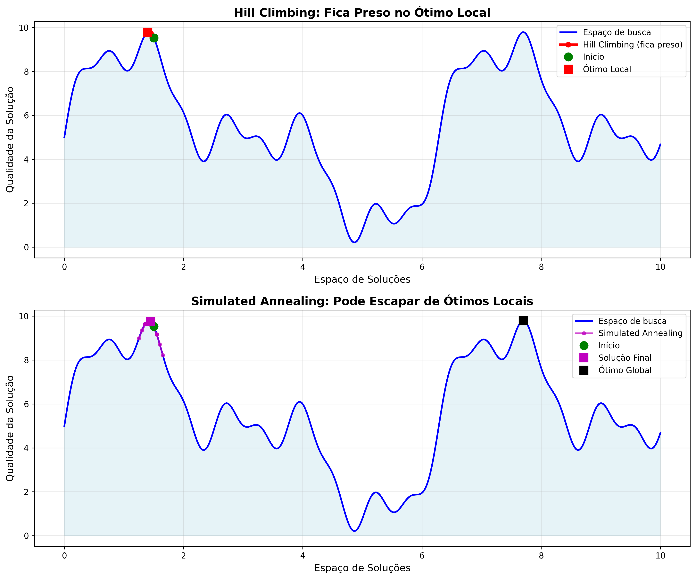
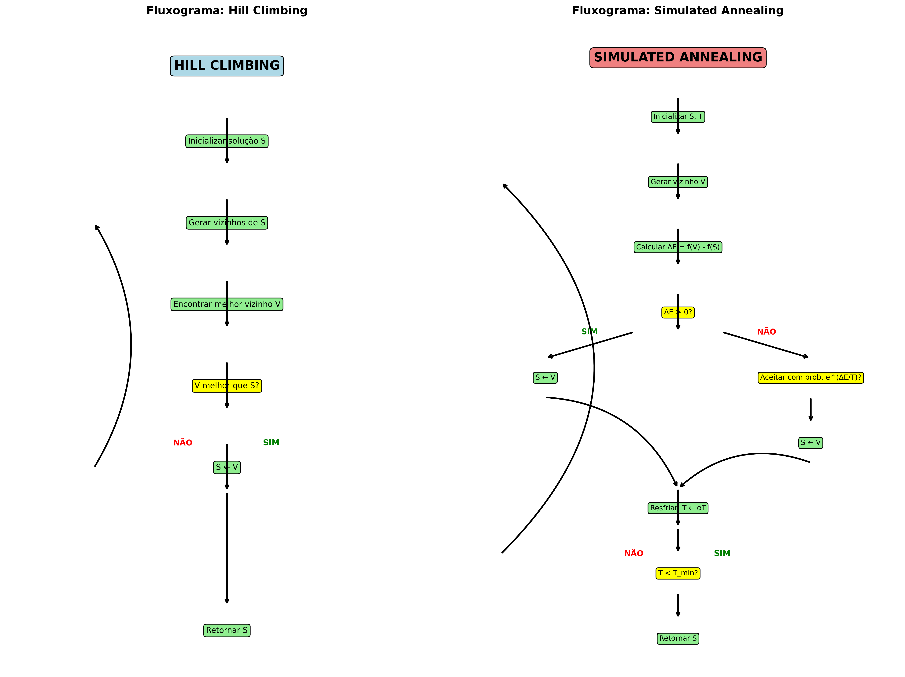
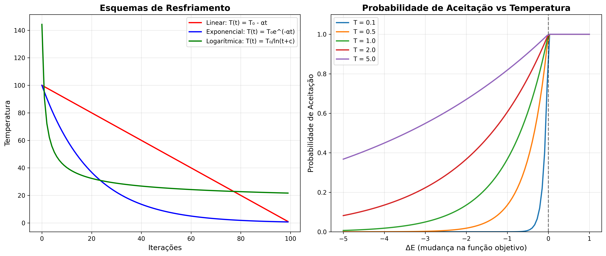

# Simulated Annealing: Algoritmo de Otimização Inspirado na Física

O **Simulated Annealing** (SA) é um algoritmo de otimização estocástica inspirado no processo físico de **recozimento** (annealing) de metais. Este processo envolve o aquecimento de um material até uma temperatura elevada e, em seguida, o resfriamento gradual, o que permite que o material alcance um estado de menor energia, ou seja, uma configuração estrutural mais estável. De forma análoga, o Simulated Annealing tenta encontrar a melhor solução para um problema de otimização, permitindo inicialmente movimentos em direção a soluções piores (aumentando a chance de escapar de ótimos locais) e, com o tempo, restringindo esses movimentos para se concentrar em melhorar a solução de maneira mais controlada.



Este algoritmo é amplamente utilizado em problemas de otimização combinatória, como o **Problema do Caixeiro Viajante (TSP)**, **agendamento de tarefas**, **planejamento de rotas** e muitos outros problemas que envolvem a busca por uma solução ótima em um espaço de busca complexo e multidimensional.

---

## **1. 🌡️ Motivação e Analogia com a Física**

### **1.1 O Processo de Recozimento de Metais**

Imagine um ferreiro trabalhando com metal:

1. **🔥 Aquecimento:** O metal é aquecido a altas temperaturas, fazendo os átomos vibrarem intensamente
2. **⚡ Energia Alta:** Com muita energia, os átomos podem se reorganizar livremente
3. **❄️ Resfriamento Gradual:** A temperatura diminui lentamente, reduzindo a energia
4. **🔧 Estabilização:** Os átomos se fixam em uma configuração de baixa energia (estável)

### **1.2 Analogia Computacional**

| **Física** | **Computação** | **Exemplo** |
|------------|----------------|-------------|
| 🌡️ **Temperatura** | Probabilidade de aceitar soluções piores | Alta T → aceita soluções ruins |
| ⚛️ **Átomos** | Variáveis da solução | Ordem das cidades no TSP |
| ⚡ **Energia** | Valor da função objetivo | Distância total do percurso |
| 🎯 **Estado estável** | Solução ótima | Menor caminho encontrado |

### **1.3 Por que Simulated Annealing Funciona?**

**🔍 Problema com Hill Climbing:**
- Fica preso em ótimos locais
- Não consegue "descer" para explorar outras regiões
- Solução muito dependente do ponto inicial

**💡 Solução do SA:**
- **Aceita soluções piores** com certa probabilidade
- **Probabilidade diminui** com o tempo (resfriamento)
- **Explora amplamente** no início, **refina** no final

---

## **2. 🔧 Funcionamento do Algoritmo Simulated Annealing**



### **2.1 Componentes Fundamentais**

O Simulated Annealing possui quatro componentes essenciais:

#### **🌡️ 1. Temperatura (T)**
- **Controla** a probabilidade de aceitar soluções piores
- **Alta temperatura:** Maior exploração, aceita soluções ruins
- **Baixa temperatura:** Menor exploração, comportamento similar ao Hill Climbing

#### **❄️ 2. Esquema de Resfriamento**
- **Define** como a temperatura diminui ao longo do tempo
- **Tipos comuns:** Linear, exponencial, logarítmico

#### **🎲 3. Critério de Aceitação (Metropolis)**
- **Fórmula:** P(aceitar) = exp(-ΔE/T)
- **ΔE:** Diferença de energia (valor da função objetivo)
- **T:** Temperatura atual

#### **⏱️ 4. Critério de Parada**
- **Temperatura mínima** atingida
- **Número máximo** de iterações
- **Qualidade** da solução aceitável

### **2.2 Passos do Algoritmo**

```
🚀 1. INICIALIZAÇÃO
   ├── Escolher solução inicial S₀
   ├── Definir temperatura inicial T₀
   └── Configurar parâmetros de resfriamento

🔄 2. LOOP PRINCIPAL (enquanto T > T_min):
   ├── 🎯 Gerar vizinho S' de S
   ├── 📊 Calcular ΔE = f(S') - f(S)
   ├── 🎲 SE ΔE ≤ 0: aceitar S' (melhoria)
   ├── 🎲 SENÃO: aceitar S' com probabilidade exp(-ΔE/T)
   └── ❄️ Resfriar: T ← α×T

🏁 3. RETORNAR melhor solução encontrada
```

### **2.3 Probabilidade de Aceitação Detalhada**



**Interpretação da Curva de Aceitação:**
- **ΔE < 0:** Sempre aceita (melhoria)
- **ΔE > 0:** Aceita com probabilidade exp(-ΔE/T)
- **T alto:** Aceita quase tudo (exploração)
- **T baixo:** Aceita apenas melhorias (refinamento)

---

## **3. 📊 Esquemas de Resfriamento (Cooling Schedules)**

A escolha do esquema de resfriamento é **crucial** para o sucesso do Simulated Annealing. Diferentes esquemas produzem comportamentos diferentes.

### **3.1 Tipos de Resfriamento**

#### **📉 Linear**
```python
T(t) = T₀ - α × t
```
**Características:**
- ✅ Simples de implementar
- ⚠️ Pode resfriar muito rápido
- 🎯 Bom para testes iniciais

#### **📈 Exponencial**
```python
T(t) = T₀ × α^t    (onde 0.8 ≤ α ≤ 0.99)
```
**Características:**
- ✅ Mais usado na prática
- ✅ Resfriamento suave
- 🎯 Boa exploração inicial

#### **📐 Logarítmico**
```python
T(t) = T₀ / log(t + c)
```
**Características:**
- ✅ Resfriamento muito lento
- ⚠️ Pode ser computacionalmente caro
- 🎯 Garantias teóricas de convergência

#### **⚡ Adaptativo**
```python
# Ajusta α baseado na aceitação de soluções
if taxa_aceitacao > 0.8:
    α = α × 0.9  # Resfria mais rápido
elif taxa_aceitacao < 0.2:
    α = α × 1.1  # Resfria mais devagar
```

### **3.2 Comparação Prática dos Esquemas**

| **Esquema** | **Velocidade** | **Qualidade** | **Uso Recomendado** |
|-------------|----------------|---------------|-------------------|
| **Linear** | 🚀 Muito rápido | ⭐ Baixa | Protótipos, testes |
| **Exponencial** | ⚡ Rápido | ⭐⭐⭐ Alta | Maioria dos problemas |
| **Logarítmico** | 🐌 Lento | ⭐⭐⭐⭐ Muito alta | Problemas críticos |
| **Adaptativo** | ⚖️ Variável | ⭐⭐⭐⭐ Muito alta | Problemas complexos |

### **3.3 Configuração de Parâmetros**

#### **🌡️ Temperatura Inicial (T₀)**
```python
def estimar_temperatura_inicial(problema, num_amostras=1000):
    """Estima T₀ baseado na variação dos valores da função objetivo"""
    valores = []
    
    for _ in range(num_amostras):
        sol1 = gerar_solucao_aleatoria(problema)
        sol2 = gerar_vizinho(sol1)
        valores.append(abs(funcao_objetivo(sol1) - funcao_objetivo(sol2)))
    
    # T₀ deve ser suficiente para aceitar 80-90% das soluções piores
    delta_medio = np.mean(valores)
    return -delta_medio / np.log(0.8)  # 80% de aceitação inicial
```

#### **❄️ Temperatura Final (T_min)**
```python
def calcular_temperatura_final(T0, precisao_desejada=0.001):
    """Calcula T_min baseado na precisão desejada"""
    return T0 * precisao_desejada
```

#### **🎛️ Taxa de Resfriamento (α)**
```python
def calcular_alpha(T0, Tf, num_iteracoes):
    """Calcula α para resfriamento exponencial"""
    return (Tf / T0) ** (1 / num_iteracoes)
```

---

## **4. 🎯 Aplicações Detalhadas do Simulated Annealing**

### **4.1 🗺️ Problema do Caixeiro Viajante (TSP)**

**Contexto:** O TSP é um problema NP-difícil clássico onde é necessário encontrar o menor caminho que visita todas as cidades exatamente uma vez.

**Por que SA é eficaz para TSP:**
- Muitos ótimos locais no espaço de busca
- Operadores de vizinhança bem definidos (2-opt, 3-opt)
- Aceita temporariamente tours piores para escapar de ótimos locais

**Implementação específica:**
```python
def sa_tsp(cidades, T0=1000, Tf=1, alpha=0.995, max_iter=10000):
    # Solução inicial: tour aleatório
    tour_atual = list(range(len(cidades)))
    random.shuffle(tour_atual)
    
    custo_atual = calcular_distancia_total(tour_atual, cidades)
    melhor_tour, melhor_custo = tour_atual.copy(), custo_atual
    
    T = T0
    
    for iteracao in range(max_iter):
        # Gerar vizinho usando 2-opt
        novo_tour = aplicar_2opt(tour_atual)
        novo_custo = calcular_distancia_total(novo_tour, cidades)
        
        # Critério de aceitação
        delta = novo_custo - custo_atual
        
        if delta < 0 or random.random() < math.exp(-delta / T):
            tour_atual = novo_tour
            custo_atual = novo_custo
            
            # Atualizar melhor solução
            if custo_atual < melhor_custo:
                melhor_tour = tour_atual.copy()
                melhor_custo = custo_atual
        
        # Resfriamento
        T *= alpha
        
        if T < Tf:
            break
    
    return melhor_tour, melhor_custo
```

### **4.2 🧠 Ajuste de Hiperparâmetros em Machine Learning**

**Aplicação:** Otimizar hiperparâmetros de modelos de ML para maximizar acurácia.

**Vantagens do SA:**
- Não precisa de gradientes
- Lida bem com funções objetivo ruidosas
- Evita ótimos locais em espaços de hiperparâmetros

**Exemplo prático:**
```python
def sa_hiperparametros(modelo, dados_treino, dados_val):
    # Definir espaço de busca
    espacos = {
        'learning_rate': (0.001, 0.1),
        'batch_size': (16, 128),
        'num_layers': (1, 5),
        'dropout': (0.1, 0.5)
    }
    
    def gerar_vizinho(params):
        novo_params = params.copy()
        # Escolher parâmetro aleatório para modificar
        param_nome = random.choice(list(espacos.keys()))
        
        if param_nome == 'batch_size' or param_nome == 'num_layers':
            # Parâmetros inteiros
            novo_params[param_nome] += random.choice([-1, 1])
        else:
            # Parâmetros contínuos
            ruido = random.gauss(0, 0.1)
            novo_params[param_nome] *= (1 + ruido)
        
        # Garantir que está dentro dos limites
        min_val, max_val = espacos[param_nome]
        novo_params[param_nome] = max(min_val, min(max_val, novo_params[param_nome]))
        
        return novo_params
    
    def avaliar_modelo(params):
        # Treinar modelo com hiperparâmetros
        modelo_temp = treinar_modelo(modelo, dados_treino, params)
        acuracia = avaliar_modelo_temp(modelo_temp, dados_val)
        return -acuracia  # Negativar porque SA minimiza
    
    # Executar SA
    return simulated_annealing(avaliar_modelo, gerar_vizinho, espacos)
```

### **4.3 📅 Agendamento de Tarefas (Job Shop Scheduling)**

**Problema:** Agendar N trabalhos em M máquinas minimizando o tempo total (makespan).

**Elementos do SA para agendamento:**
- **Solução:** Sequência de operações
- **Vizinhança:** Trocar ordem de operações
- **Função objetivo:** Tempo de conclusão do último trabalho

```python
class AgendamentoSA:
    def __init__(self, trabalhos, maquinas):
        self.trabalhos = trabalhos  # Lista de (tempo, máquina_requerida)
        self.maquinas = maquinas
        
    def calcular_makespan(self, sequencia):
        """Calcula tempo total do agendamento"""
        tempo_maquinas = [0] * len(self.maquinas)
        
        for job_id in sequencia:
            tempo_job, maquina_id = self.trabalhos[job_id]
            tempo_maquinas[maquina_id] += tempo_job
        
        return max(tempo_maquinas)
    
    def gerar_vizinho(self, sequencia):
        """Gera vizinho trocando dois trabalhos aleatórios"""
        nova_seq = sequencia.copy()
        i, j = random.sample(range(len(nova_seq)), 2)
        nova_seq[i], nova_seq[j] = nova_seq[j], nova_seq[i]
        return nova_seq
```

### **4.4 🎨 Processamento de Imagens (Image Segmentation)**

**Aplicação:** Segmentar imagens minimizando energia de Potts.

```python
def sa_segmentacao_imagem(imagem, num_segmentos, T0=10, alpha=0.99):
    """
    Segmenta imagem usando SA com modelo de energia
    """
    altura, largura = imagem.shape
    
    # Inicializar segmentação aleatória
    segmentacao = np.random.randint(0, num_segmentos, (altura, largura))
    
    def calcular_energia(seg):
        """Energia baseada em suavidade e similaridade"""
        energia = 0
        
        # Termo de suavidade (vizinhos devem ter mesmo rótulo)
        for i in range(altura-1):
            for j in range(largura-1):
                if seg[i,j] != seg[i+1,j]:
                    energia += 1
                if seg[i,j] != seg[i,j+1]:
                    energia += 1
        
        # Termo de dados (pixels similares devem ter mesmo rótulo)
        for s in range(num_segmentos):
            mask = (seg == s)
            if np.sum(mask) > 0:
                media = np.mean(imagem[mask])
                energia += np.sum((imagem[mask] - media)**2)
        
        return energia
    
    # Aplicar SA
    energia_atual = calcular_energia(segmentacao)
    T = T0
    
    while T > 0.1:
        # Modificar pixel aleatório
        i, j = random.randint(0, altura-1), random.randint(0, largura-1)
        novo_rotulo = random.randint(0, num_segmentos-1)
        
        rotulo_original = segmentacao[i,j]
        segmentacao[i,j] = novo_rotulo
        
        nova_energia = calcular_energia(segmentacao)
        delta = nova_energia - energia_atual
        
        if delta > 0 and random.random() > math.exp(-delta / T):
            # Rejeitar mudança
            segmentacao[i,j] = rotulo_original
        else:
            energia_atual = nova_energia
        
        T *= alpha
    
    return segmentacao
```

---

## **4. Vantagens e Limitações**

### **4.1 Vantagens**
- **Capacidade de evitar ótimos locais**: Ao permitir a aceitação de soluções piores no início, o algoritmo evita que ele se prenda em ótimos locais.
- **Versatilidade**: Pode ser aplicado em uma ampla gama de problemas de otimização.
- **Simplicidade**: A implementação do Simulated Annealing é relativamente simples e intuitiva.

### **4.2 Limitações**
- **Sensibilidade à escolha dos parâmetros**: O desempenho do SA depende fortemente da escolha da temperatura inicial, da taxa de resfriamento e do número de iterações.
- **Custo computacional**: Embora o SA não seja tão intensivo quanto outros métodos, ele ainda pode ser caro computacionalmente, especialmente em problemas de grande escala.
- **Não garante a solução ótima**: Assim como outros algoritmos heurísticos, o SA pode não encontrar a solução ótima, mas apenas uma boa aproximação.

---

## **5. Referências Bibliográficas**

1. **Kirkpatrick, S., Gelatt, C. D., & Vecchi, M. P. (1983).** *Optimization by Simulated Annealing*. Science, 220(4598), 671-680.
2. **Aarts, E., & Korst, J. (1989).** *Simulated Annealing and Boltzmann Machines*. Wiley.
3. **Cerny, V. (1985).** *Thermodynamical Approach to the Traveling Salesman Problem: An Efficient Simulation Algorithm*. Journal of Optimization Theory and Applications, 45(1), 41-51.
4. **Cohn, D. (1993).** *Artificial Intelligence: A Modern Approach*. Pearson Education.

---

## **6. Conclusão**

Simulated Annealing é uma técnica poderosa para a otimização de problemas complexos, sendo útil principalmente quando a solução ótima é difícil de encontrar devido ao tamanho ou complexidade do espaço de busca. Sua habilidade de escapar de ótimos locais e encontrar boas soluções aproximadas o torna uma escolha popular para muitos tipos de problemas, especialmente em áreas como otimização combinatória e aprendizado de máquina. No entanto, seu desempenho depende significativamente da escolha dos parâmetros e do controle cuidadoso do processo de resfriamento, destacando a necessidade de uma adaptação cuidadosa do algoritmo para problemas específicos.